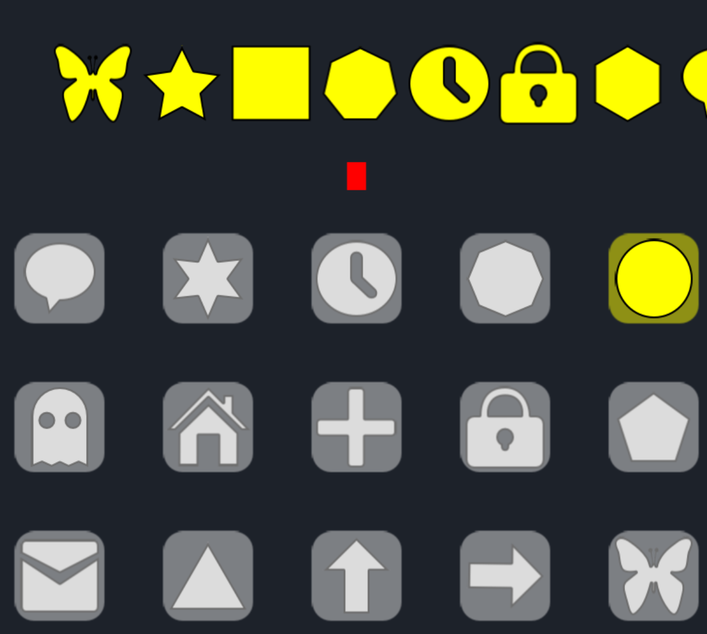

#PREfectionist

Match shapes with their appropriate slots.  Beat the clock to advance to the next level.  It can get pretty difficult using a mouse but is a lot of fun on a tablet, especially if you are playing it with another person.

##onegameaweek - Game 1
I thought I'd step it up this year and try to make a game every week and this is the first.

You can play the game [here](http://divideby5.com/games/prefectionist).

##Tools
Developed using [Phaser.js](http://phaser.io)

SFX - Made using [cfxr](http://thirdcog.eu/apps/cfxr)

Sprites
* Pixelmator and Bitmap Data

